# Using NuEclipse as GDB Frontend

This document gets you debugging GCC-compiled programs
running on Nuvoton's Cortex-M series SoC
using NuEclipse, Nuvoton's fork of Eclipse, as GDB frontend.

> **ℹ️ Information**
>
> Though this document is written mainly for [Zephyr programs](https://github.com/zephyrproject-rtos/zephyr),
> it can also apply to other GCC-compiled programs.

## Hardware requirements

-   Target board based on Nuvoton's Cortex-M series SoC
-   [Nu-Link or Nu-Link2 adapter](https://github.com/OpenNuvoton/Nuvoton_Tools#nu-link2-pro-debugging-and-programming-adapter)

## Software requirements

-   Host operating system: Windows 10 64-bit or afterwards

    > **ℹ️ Information**
    >
    > Most users of Nuvoton's Cortex-M series SoC develop on Windows, so this document favors this environment.

-   [NuEclipse](https://github.com/OpenNuvoton/Nuvoton_Tools#numicro-software-development-tools): Nuvoton's fork of Eclipse

-   OpenOCD: Attached with NuEclipse installation package

-   Cross GCC compiler: [Arm GNU Toolchain](https://developer.arm.com/Tools%20and%20Software/GNU%20Toolchain)

-   Zephyr development environment: [Developing with Zephyr](https://docs.zephyrproject.org/latest/develop/index.html)

## Debugging Zephyr program

In the following, we show how to debug Zephyr program using NuEclipse.

1.  Build one Zephyr sample program e.g. `hello_world`
    ```
    $ cd zephyrproject
    $ west build -b numaker_pfm_m467 zephyr/samples/hello_world
    ```

    Name the generated `build/zephyr/zephyr.elf` as `<zephyr_elf>`.

1.  Launch NuEclipse

    Make a note of the workspace path as `<eclipse-workspace>`.

    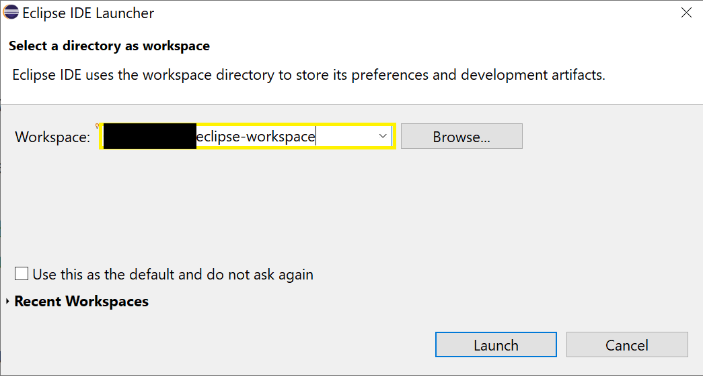

1.  Import the program executable and create debug-only project

    1.  Click **File** > **Import**

    The **Import** dialog box appears.

    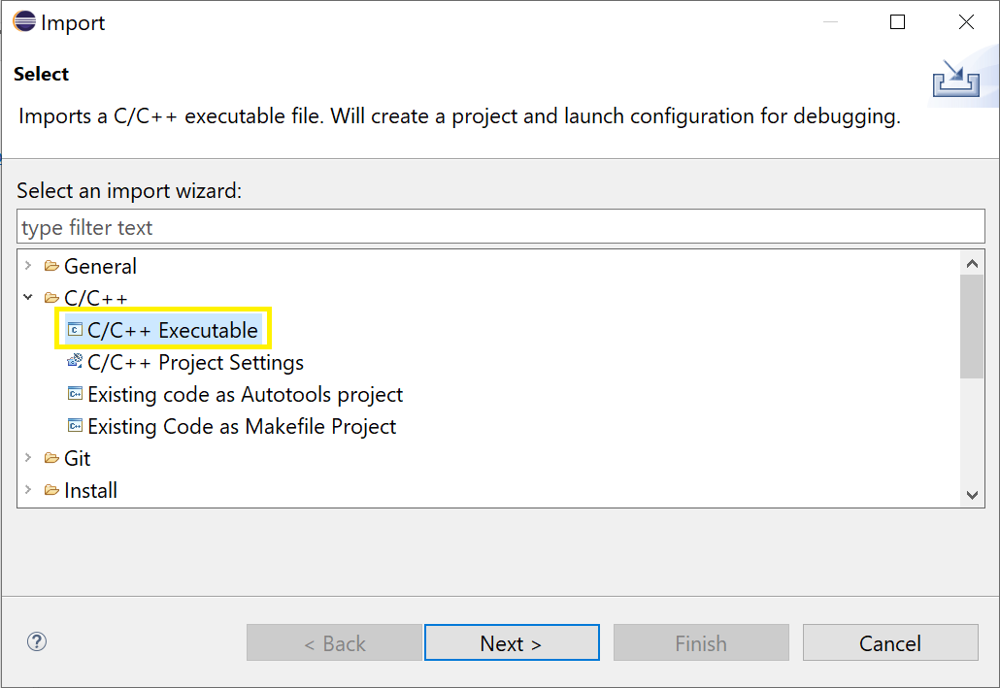

    1.  Click **C/C++** > **C/C++ Executable**

    1.  Click **Next**.

    The **Import Executable** dialog box appears.

    1.  Check **Select executable** radio button

        Browse and select executable as `<zephyr_elf>`.

    1.  Click **Next**

    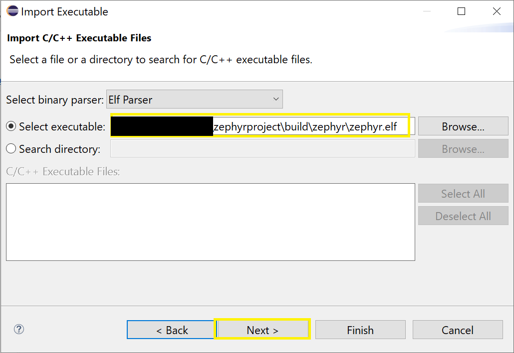

    1.  Check **New project name** radio button

        Set the new project name to `Debug_zephyr.elf`, or use the default.
        Name it as `<Debug_zephyr.elf>`.

    1.  Uncheck **Create a Launch Configuration** checkbox

    1.  Click **Finish**

    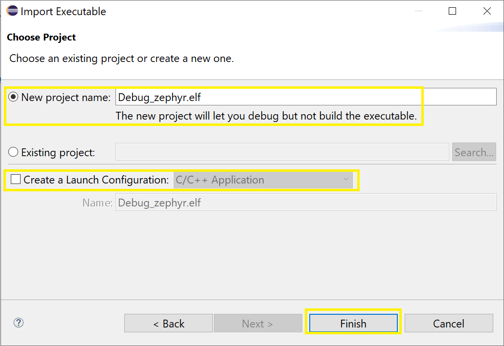

    The created debug-only project will locate at:
    ```
    <eclipse-workspace>/<Debug_zephyr.elf>/.cproject
    <eclipse-workspace>/<Debug_zephyr.elf>/.project
    ```

1.  Make the created debug-only project as active

    1.  Click on `<Debug_zephyr.elf>`

    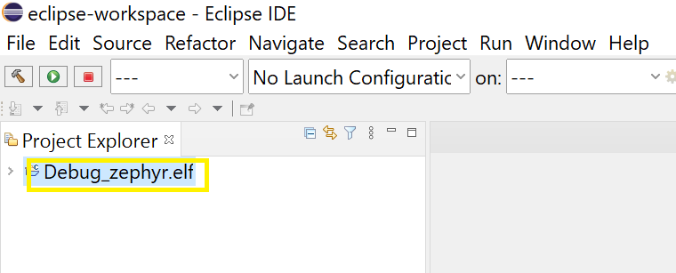

    Now `<Debug_zephyr.elf>` becomes active.

    > **⚠️ Warning**
    >
    > Missing this step, create **GDB Nuvoton Nu-Link Debugging** Debug Configuration later will fail.

1.  Download **GDB Nuvoton Nu-Link Debugging** debug configuration file `preferences.ini`

    For M460 series, download [M460 preferences.ini](https://github.com/OpenNuvoton/m460bsp/blob/master/SampleCode/StdDriver/ACMP_CompareDAC/GCC/preferences.ini)
    and save into `<Debug_zephyr.elf>` project directory:
    ```
    <eclipse-workspace>/<Debug_zephyr.elf>/.cproject
    <eclipse-workspace>/<Debug_zephyr.elf>/.project
    <eclipse-workspace>/<Debug_zephyr.elf>/preferences.ini
    ```

    > **❌ Error**
    >
    > The file `preferences.ini` is target SoC specific.
    **Don't skip this step** even though NuExlipse can generate one automatically,
    which wouldn't match the target SoC.

1.  Create Debug Configuration

    1.  Click **Run** > **Debug Configurations**

    The **Debug Configurations** dialog box appears.

    1.  Double-click on **GDB Nuvoton Nu-Link Debugging**

        Name the created Debug Configuration as `<Debug_zephyr.elf Configuration>`.

    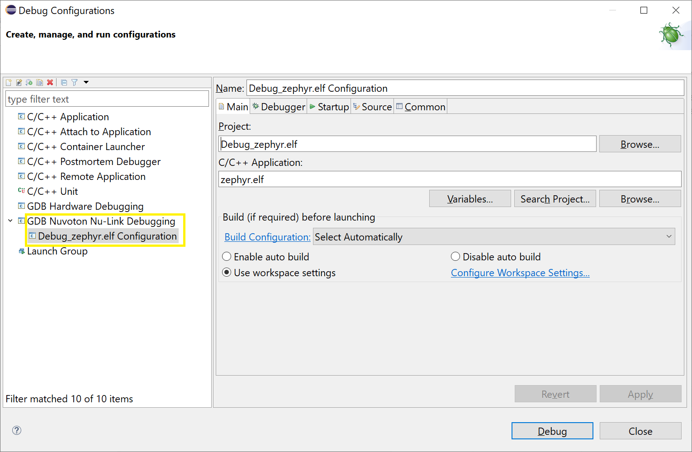

    1.  Switch to **Debugger** tab

    1.  In **GDB Client Setup** group, click **Variables**

    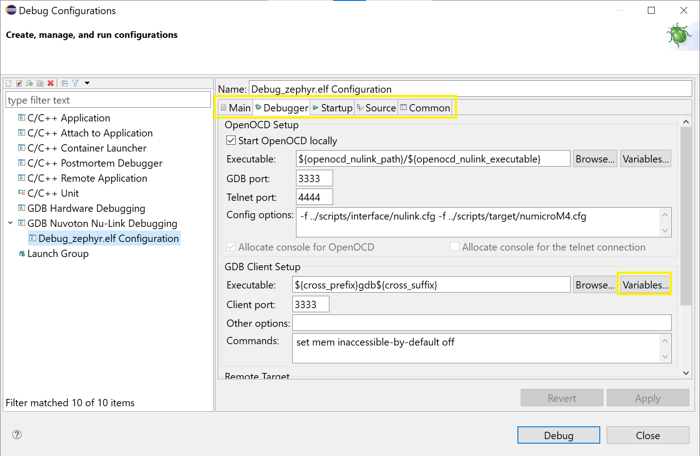

    The **Select Variable** dialog box appears.

    1.  Straight click **Edit Variables**

    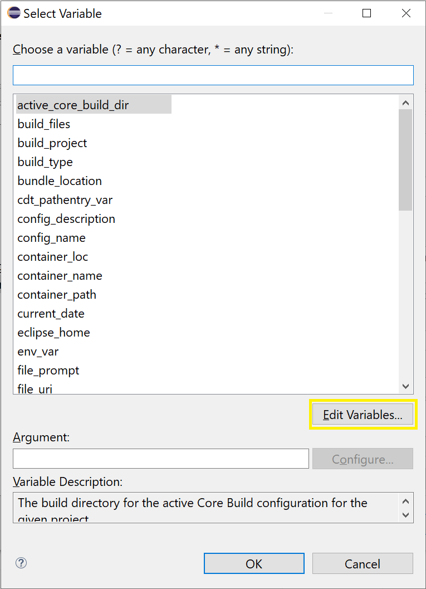

    The **Preferences** dialog box appears.

    1.  Click **New**

    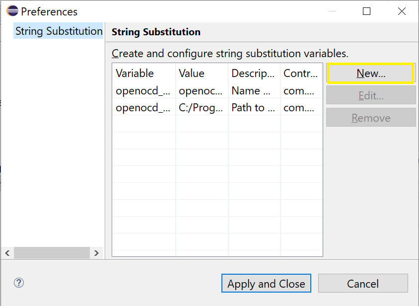

    The **New String Substitution Variable** dialog box appears.

    1.  Set **Name** to `cross_prefix`

    1.  Set **Value** to cross gdb path plus `arm-none-eabi-` prefix

        On Windows, this would be:
        ```
        C:\Program Files (x86)\Arm GNU Toolchain arm-none-eabi\13.2 Rel1\bin\arm-none-eabi-
        ```
        So that `${cross_prefi}gdb${cross_suffix}` would expand to:
        ```
        C:\Program Files (x86)\Arm GNU Toolchain arm-none-eabi\13.2 Rel1\bin\arm-none-eabi-gdb
        ```

    1.  Click **OK**

    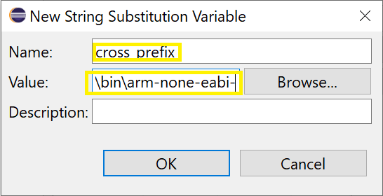

    > **ℹ️ Information**
    >
    > The `<Debug_zephyr.elf>` project doesn't pass cross gdb path and prefix/suffix parameters
    > to the `<Debug_zephyr.elf Configuration>` Debug Configuration,
    > To fix it, we manually add Eclipse variable `cross_prefix` here.
    > With `cross_prefix` being cross gdb path plus `arm-none-eabi-` prefix
    > and `cross_suffix` being empty (not added),
    > `${cross_prefi}gdb${cross_suffix}` can expand to desired result.

    1.  Back to **Preferences** dialog box, click **Apply and Close**

    1.  Back to **Select Variable** dialog box, click **Cancel**

    1.  Back to **Debug Configurations** dialog box, click **Close**

1.  Start debugging

    Not in debug session,

    1.  Click **Run** > **Debug Configurations**

    The **Debug Configurations** dialog box appears.

    1.  Click on `<Debug_zephyr.elf Configuration>`
    
    1.  Click **Debug**

    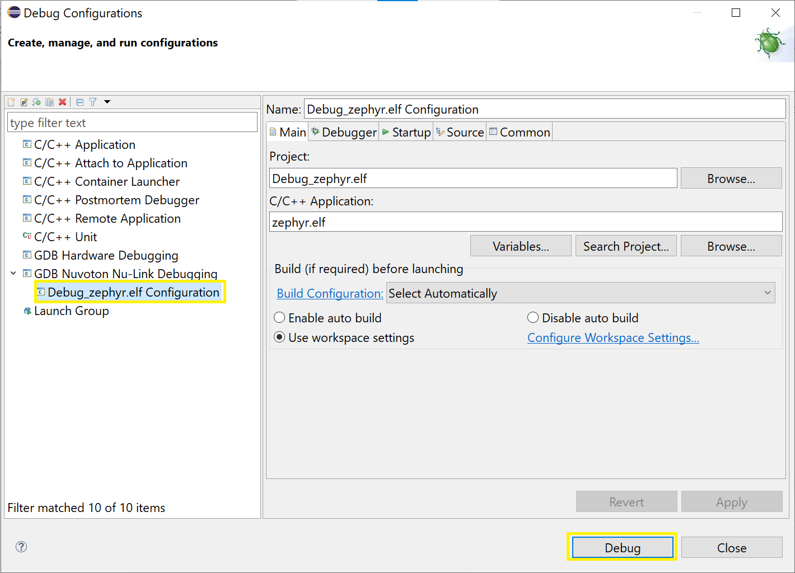

1.  Stop debugging

    In debug session,

    1.  Click **Run** > **Terminate**

## Advanced tips

In the chapter, we address advanced tips with debugging using NuEclipse.

-   Debug startup assembly code

    1.  Click **Run** > **Debug Configurations**

    The **Debug Configurations** dialog box appears.

    1.  Click on `<Debug_zephyr.elf Configuration>`

    1.  Switch to **Startup** tab

    1.  In **Run/Restart Commands** group, uncheck **Set breakpoint at main** and **Continue**

    1.  Click **Apply**

    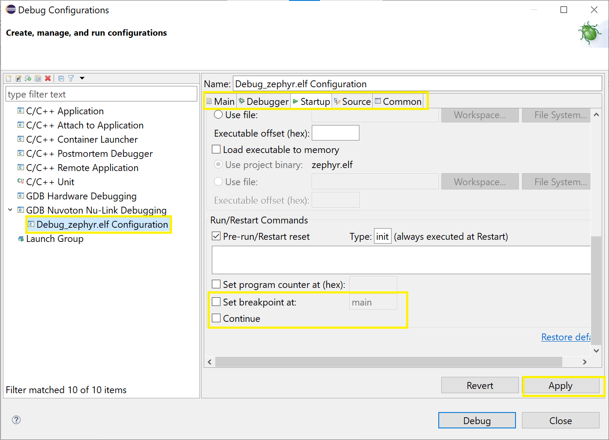

## Troubleshooting

In the chapter, we troubleshoot with debugging using NuEclipse.

-   Create **GDB Nuvoton Nu-Link Debugging** Debug Configuration failed

    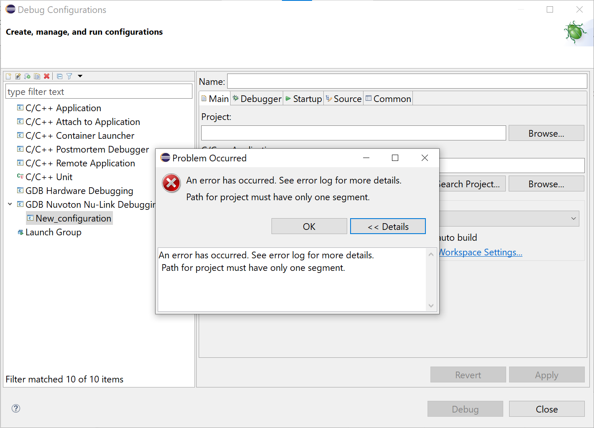

    > **℟ Response**
    >
    > This is caused by not making the created debug-only project as active.
    > Check above step.

-   Start debugging failed with gdb not found

    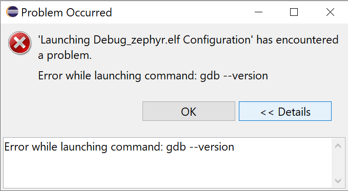

    > **℟ Response**
    >
    > This is caused by not adding Eclipse variable `cross_prefix` correctly.
    > Check above step.

-   Source level debugging doesn't match exactly

    > **℟ Response**
    >
    > Try to reduce optimization level.
    >
    > On Zephyr, this can be done overriding CMake variables `EXTRA_CFLAGS`/`EXTRA_CXXFLAGS`:
    >
    > ```
    > $ west build -b numaker_pfm_m467 zephyr/samples/hello_world -DEXTRA_CFLAGS="-O1" -DEXTRA_CXXFLAGS="-O1"
    > ```

    > **⚠️ Warning**
    >
    > Not suggest optimization level `O0` because program can meet stack overflow easily.

## Known limitations

In the chapter, we address known limitations with debugging using NuEclipse.

-   Not support postmortem debugging
